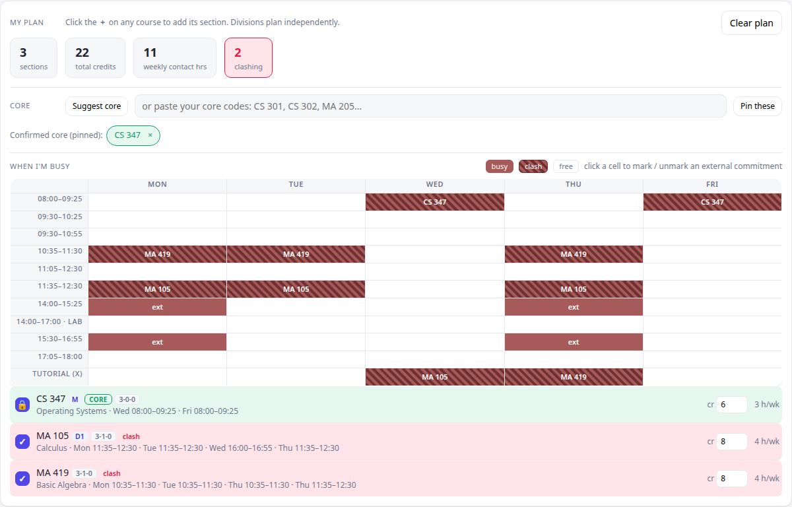
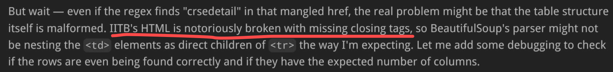
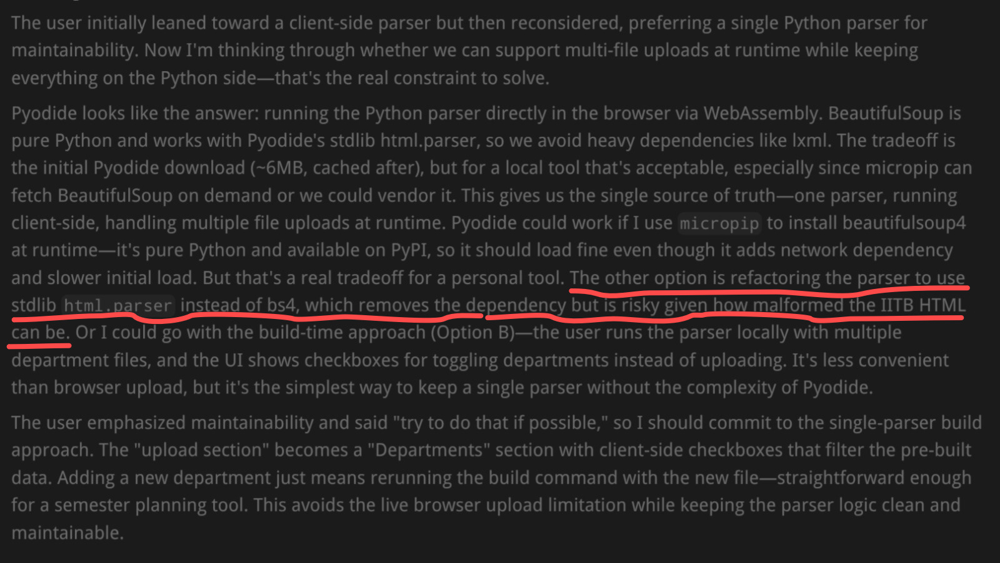

# Vibe Selecting Courses (VS Course)

> Plan your IIT-Bombay semester by vibes, not by refreshing ASC for the fortieth time.

## What it is

VS Course is an offline, browser-based course browser and planner for the IIT-Bombay
ASC (Academic Support Console), the portal you love to hate every registration season.
You feed it your own saved ASC course pages and it turns that 2003-era frameset HTML
into something you can actually plan with:

- Filter courses by time-slot, department, level, and eligibility.
- Plan electives with automatic credit estimation, worked out from each course's L-T-P
  (lecture / tutorial / practical) hours.
- Clash detection, so you stop accidentally enrolling in two courses that meet at the
  same time.
- A weekly "When I'm busy" table, so your timetable is a grid instead of a guess.

Everything runs locally in your browser via [Pyodide](https://pyodide.org) (Python,
compiled to WebAssembly). Your course data never leaves your machine. There is no
server, no upload, no account, and no telemetry. The page starts empty and you decide
what goes in.

## Screenshots



*The planner tallies credits and weekly contact hours, flags time-clashes (the pink
rows and hatched cells), and paints a Mon-Fri "When I'm busy" grid. Screenshot by
Claude Opus, the AI that built VS Course.*

## Quick start (offline, recommended)

```
git clone https://github.com/hellomath010118/VS-Course.git
cd VS-Course
python3 serve.py
```

This opens the tool in your browser and runs fully offline using the bundled
`pyodide/` runtime, with zero external network requests. You only need Python 3.8+
(standard library only, nothing to `pip install`).

Why a tiny server instead of double-clicking the file? Browsers refuse to load a local
Python runtime straight off a `file://` page, so `serve.py` hands it over
`http://localhost` instead. It serves its own folder and opens the tab for you.

## Or just open one file (needs internet)

Prefer not to clone anything? Open `timetable-share.html` directly. It is a single,
self-contained page that loads Pyodide from a CDN at runtime, which is handy for quick
sharing, sending to a friend, or opening on your phone. The catch is that it needs an
internet connection, whereas the offline build above does not.

## Loading your courses

The tool starts empty. It ships with no course data, because your course list is yours.

First, install the free SingleFile browser extension. This step is essential: ASC
renders its course listing inside nested frames, so a plain "Save Page As" will not
capture it. [SingleFile](https://github.com/gildas-lormeau/SingleFile) flattens the
entire page (frames, styles, everything) into one `.html` file, which is exactly what
VS Course reads.

Install it for [Firefox](https://addons.mozilla.org/firefox/addon/single-file),
[Chrome / Edge / Brave](https://chromewebstore.google.com/detail/singlefile/mpiodijhokgodhhofbcjdecpffjipkle),
[Safari](https://apps.apple.com/us/app/singlefile-for-safari/id6444322545), or
[Firefox for Android](https://addons.mozilla.org/android/addon/single-file).

Then:

1. Open the ASC course page you want and let it fully load.
2. Click the SingleFile toolbar button (or press `Ctrl+Shift+Y`) to save the page as a
   single `.html` file.
3. Drag and drop that saved `.html` onto the VS Course tool.

Repeat for as many departments as you like. Add several, then toggle them on and off as
you compare options. All parsing happens client-side, live.

## Rebuilding (for tinkerers)

`asc_parser.py` is the single source of truth. It is both the parser and the site
builder, and at build time it embeds its own source into the page, so the browser runs
the exact same parser you would run on the command line.

```
python3 asc_parser.py --build   # offline build -> timetable.html (uses ./pyodide/)
python3 asc_parser.py --cdn     # share build   -> timetable-share.html (uses a CDN)
```

Edit `template.html` for layout and styling, edit `asc_parser.py` for parsing logic,
then rebuild.

## What Claude Opus thinks of ASC

Building this meant reading ASC's HTML directly, and Claude Opus (the AI that wrote the
parser) did not enjoy the experience. Two moments from its notes, mid-parse:





*Roasts courtesy of Claude Opus.*

## A roast of every file

Because a repo you cannot laugh at is a repo you will never open again:

- `asc_parser.py`: the overachiever. Fluent in the lost dialect of
  ASC's frameset-era HTML, it parses your courses, estimates your credits, builds the
  website, and smuggles a copy of itself into every page it generates. Single source of
  truth, zero chill.
- `timetable.html`: the offline build. A 120 KB page that quietly boots a 14 MB Python
  runtime the instant you open it, then runs with your Wi-Fi switched off out of sheer
  principle.
- `timetable-share.html`: its extrovert twin. One file, no folder, borrows Python from
  a CDN.
- `serve.py`: exists purely because your browser refuses to trust files living on your
  own hard drive. A tiny localhost server whose entire life's work is opening one
  browser tab. It has made peace with this.
- `pyodide/`: 14 MB of Do not open it. Do not question it.
- `README.md`: you are reading it. It roasts every other file in the repo and then
  roasts itself. Roughly 40% instructions, 60% coping mechanism.

Made for surviving ASC registration.
